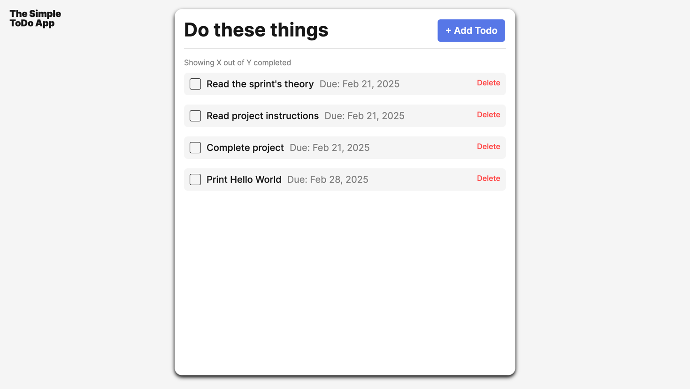

# Simple Todo App

This project is a **simple task management application** that allows users to create, edit, and delete to-do items. It helps users organize their tasks by providing a structured interface with a list of pending tasks and their due dates.



## Functionality

The application includes the following features:

- **Add New Tasks**: Users can input new to-do items and specify a due date.
- **Mark Tasks as Completed**: Users can check completed tasks, which visually updates their status.
- **Delete Tasks**: Users can remove tasks from the list.
- **Unique Task IDs**: Each task is assigned a unique identifier for better tracking.
- **Reset Form and Controls**: After adding a task, the input fields are cleared automatically.
- **Dynamic Rendering**: The task list updates dynamically when users add or remove tasks.

## Technology

This project is built using:

- **HTML**: For structuring the web page.
- **CSS**: For styling the user interface.
- **JavaScript (ES6+)**: For handling interactivity and dynamic DOM manipulation.
- **Template Elements**: Used for creating task items dynamically.
- **Event Listeners**: For handling user interactions.

### Project Structure
The project follows a modular approach:

```
/project-folder
│── blocks/ # CSS styles for components
│   │── button.css
│   │── form.css
│   │── counter.css
│   │── header.css
│   │── page.css
│   │── popup.css
│   │── todo.css
│   │── todos.css
│── components/ # JavaScript classes
│   │── FormValidator.js # Form validation class
│   │── Popup.js # Popup dialog class
│   │── PopupWithForm.js # Form popup dialog class
│   │── Section.js # Section rendering class
│   │── Todo.js # Task management class
│   │── ToDoCounter.js # Task counter class
│── images/ # Image assets
│── pages/ # Main application components
│   │── index.js
│   │── index.css
│── scripts/
│   │── validate.js  # Form validation functions
│── utils/
│   │── constants.js  # Stores configuration and templates
│── vendor/ # External libraries
│── index.html  # Main HTML file
```

## Deployment

This project is deployed on **GitHub Pages**:

- https://pavkv.github.io/se_project_todo-app/

---

### 🚀 Additional Enhancements (Future Improvements)
- Add **drag-and-drop sorting** for task prioritization.
- Implement **persistent storage** using Local Storage or a database.
- Introduce **categories or labels** for better task organization.
- Highlight **overdue tasks** with a visual indicator.

